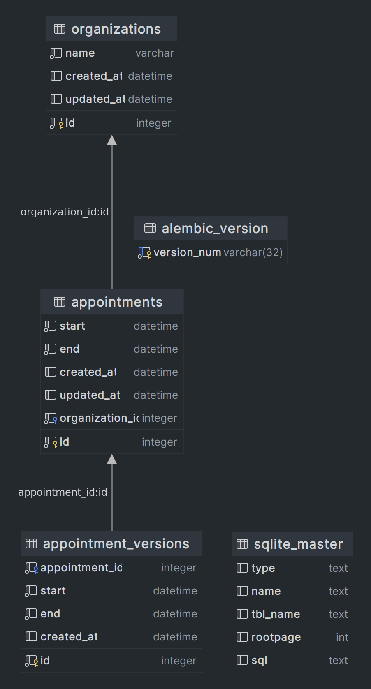

# Appointment_core

This is a simple appointment system that allows users to book appointments with a every organization.

## Installation
```
docker compose up -d
docker compose up app
```

## Usage
### Docs URL
```
http://localhost:8000/docs
http://localhost:8000/redoc
```

## Environments
```
DB_NAME=<DB_NAME>
DB_USER=<DB_USER>
DB_PASS=<DB_PASS>
JWT_SECRET_KEY=<SECRET_KEY>
JWT_REFRESH_SECRET_KEY=KEY>
```


## ERD


#


## 

