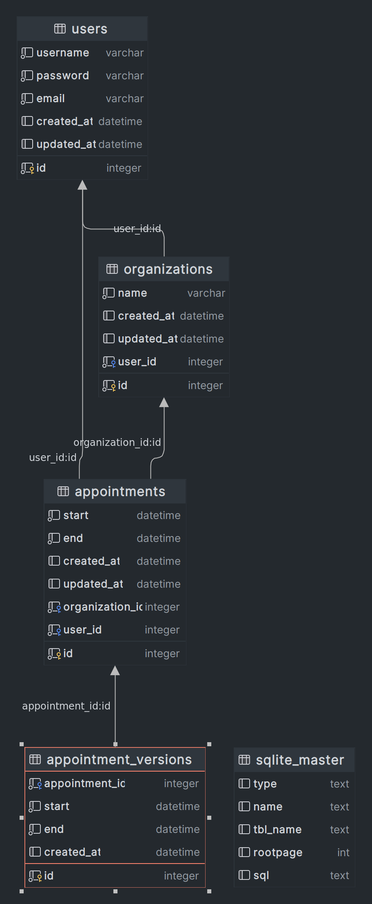

# Appointment_core

This is a simple appointment system that allows users to book appointments with a every organization.

## Installation
```
docker compose up -d
docker compose up app
```

## Usage
### Docs URL
```
http://localhost:8000/docs
http://localhost:8000/redoc
```


## ERD


## TODO
- [ ] Add alembic docs for database migration
- [ ] Add more tests

## 

